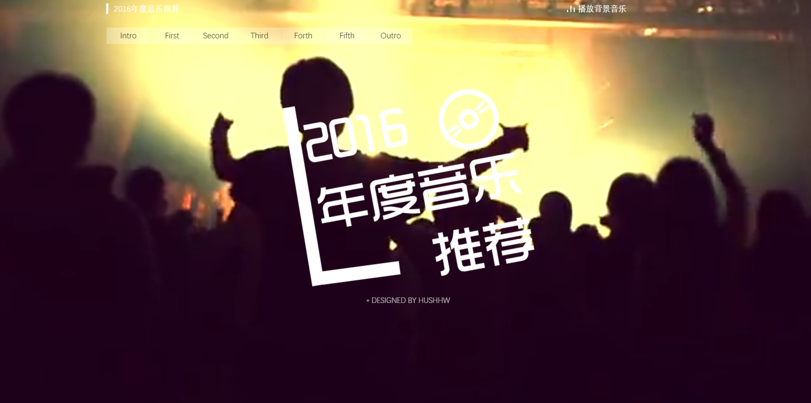
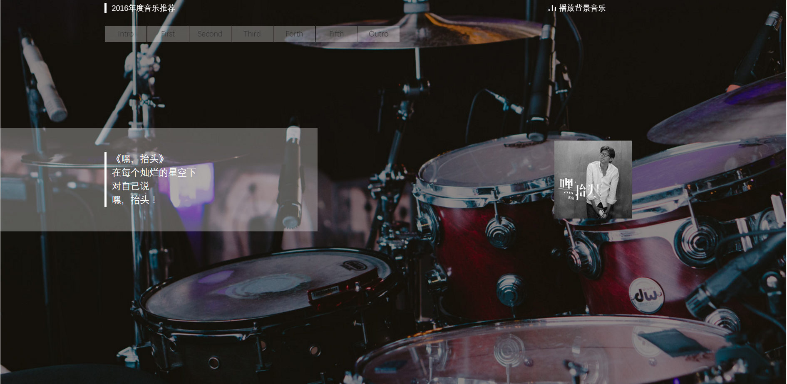
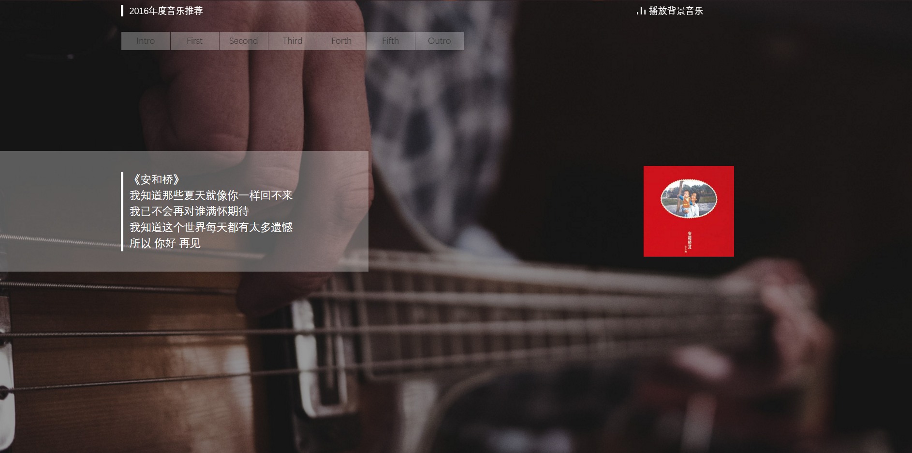

# Music-recommendation-in-2016
《2016年度音乐推荐》静态网页，仿豆瓣年度总结

大二实践课程通过实践操作制作网站，熟悉html+css+javascript的知识，在实际操作中复习巩固和学习更多新的知识点，学习使用浏览器调试工具对网页制作学习。

《2016年度音乐推荐》，选择这作为选题的原因有二，一是初次接触前端，实践课程完成一个网页要么有困难，要么会很难看，所以打算仿豆瓣年度总结来做一个；二是刚刚2016年过去之后，各大门户网站便纷纷采用最新的html5技术制作各种丰富的年关回顾网站刷遍每个人的移动端，PC端设备，于是想通过本次课程设计来制作类似的网站来回顾过去一年在网易云音乐收听的音乐次数排行，作为推荐我自己的音乐歌单。

